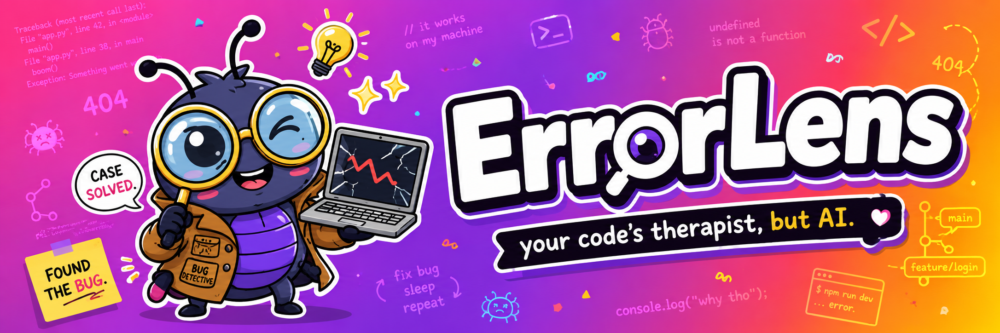

# ErrorLens

Self-hosted, AI-native error tracking. An open-source alternative to
Sentry/GlitchTip that doesn't just show you *what* broke — it tells you
*why*.

Self-hosted, own forever. No per-seat pricing, no vendor lock-in, your
error data never leaves your infrastructure.

> **Status**: under active development.

## Why ErrorLens

Sentry/GlitchTip show you the stack trace and the occurrence count.
Debugging is still entirely on you: cross-referencing that trace against
recent commits, reading unfamiliar code, forming a hypothesis. That
correlation work is exactly what an LLM is good at, and it's not a
first-class feature in existing error trackers. ErrorLens makes it one.

## How It Works

1. Drop a lightweight SDK into your Node/Express app. It watches for
   errors without ever blocking or crashing the app it's protecting.
2. When something breaks, ErrorLens captures the full picture — the error,
   the stack trace, the surrounding code — and sends it to your own
   self-hosted instance.
3. Repeat occurrences of the same error are recognized instantly and
   grouped together, so you get one clear signal instead of alert spam.
4. New, unique errors get two layers of enrichment: ErrorLens looks at
   your recent git history to find the commit that most likely caused it,
   then an LLM explains the root cause in plain English with a suggested
   fix.
5. You get one clean alert — the error, the likely cause, the suggested
   fix, the suspect commit — delivered wherever your team already looks:
   Slack, Microsoft Teams, Discord, or any webhook you point it at.
6. Resolve or ignore errors as you work through them. No bloated
   dashboard to babysit — everything is scriptable.

## Who It's For

- Solo developers and small teams running multiple services who want
  Sentry-grade visibility without per-seat SaaS pricing.
- Anyone running several production apps with no unified error visibility
  across any of them today.
- Anyone who wants their error data to stay on their own infrastructure,
  not a third party's.

## Multi-Project, One Instance

Run a single ErrorLens instance and register every service you own as its
own project — each with its own key, its own alert destination, and its
own repo linked for git correlation. Errors from one project never leak
into another.

## Contributing

See [CONTRIBUTING.md](./CONTRIBUTING.md) for how to contribute, and
[CODE_OF_CONDUCT.md](./CODE_OF_CONDUCT.md) for community guidelines.

## License

[MIT](./LICENSE) © Manish Dash Sharma
